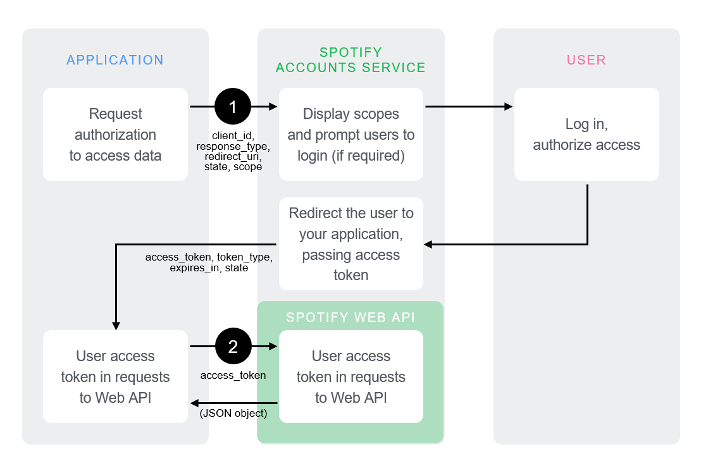
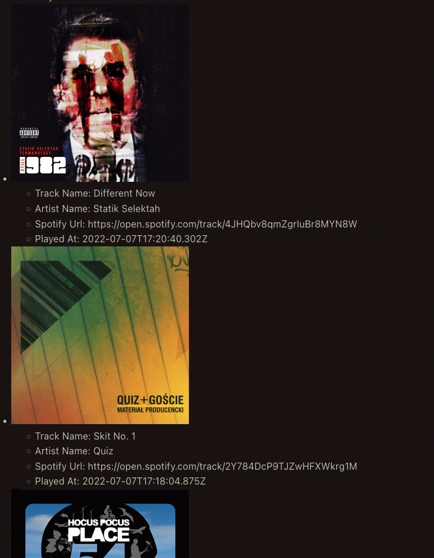
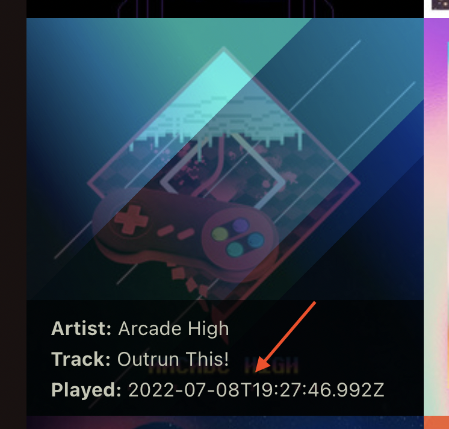
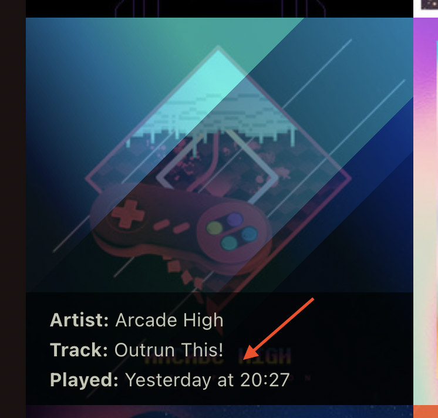
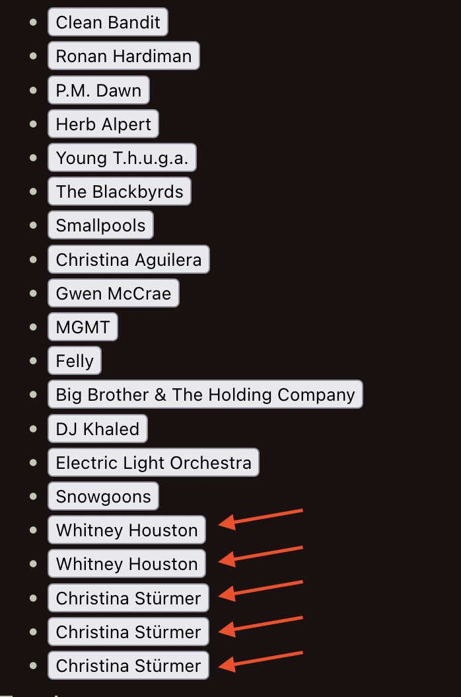
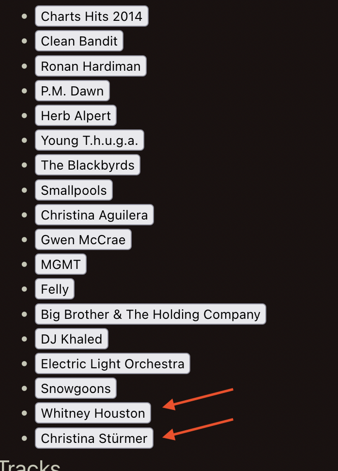

# Risk Ledger Frontend Code Exercise

# Code Exercise
If you don’t have any existing code you can show us, we’ve put together a code exercise for you to complete in your own time.
We would like you to build a frontend single-page application, using any modern web framework of your choice. Your app should use the  [Spotify Web API](https://developer.spotify.com/documentation/web-api/)  to meet the below requirements, using the Implicit Grant Flow described within the documentation for authentication.

* A user should be able to view a grid of their recently played tracks.
	* This should include a relevant image for each track.
* In a sidebar, a user should be able to view a list of all recently played artists.
	* This should be in order of most recently played.
	* On click of an artist, the grid of recently played tracks should be filtered by the relevant artist.
	* On refresh of the page, any applied filter should be persisted.
## Bonus
* The displayed data should automatically update when a user listens to a new track (within 30 seconds).
Please include a README detailing how we can run your submission, the trade-offs you made, and how you’d improve on your request.

&nbsp;

# How to run the project
## Recommended IDE Setup

[VSCode](https://code.visualstudio.com/) + [Volar](https://marketplace.visualstudio.com/items?itemName=Vue.volar) (and disable Vetur) + [TypeScript Vue Plugin (Volar)](https://marketplace.visualstudio.com/items?itemName=Vue.vscode-typescript-vue-plugin).

## Project Setup

```sh
npm install
```

### Compile and Hot-Reload for Development

```sh
npm run dev
```

&nbsp;

# What would I do if I have more time:
It took me around 6-7 hours to get to this point. Currently, the App is still missing:

- Unit tests - I would test the API by mocking responses and checking if everything works fine based on these mocks.
- Logout button - at the moment, the only two ways to logout are
	- Wait one hour until the `access_token` expires
	-  Manually remove the `access_token` from the localStorage
- Correlating requests and responses using a saved "stateKey." - I would use this approach


&nbsp;

# My Notes: (thought process in chronological order)
- I have never worked with Spotify API before. Therefore, I am going to start by reading the documentation
- Ok, so after a quick read, I learned that my first step should be a creation of an app following the  [app settings guide](https://developer.spotify.com/documentation/general/guides/authorization/app-settings)
- Then, to use the Implicit Grant Flow, I have to follow this diagram:



- To save time, I will use one of my previous Vue3 projects as a scaffold ([GitHub](https://github.com/OziOcb/teamwork-assignment)).
- Now I start from building the authorisation request based on the documentation and this example

```javascript
var client_id = 'CLIENT_ID';
var redirect_uri = 'http://localhost:8888/callback';

var state = generateRandomString(16);

localStorage.setItem(stateKey, state);
var scope = 'user-read-private user-read-email';

var url = 'https://accounts.spotify.com/authorize';
url += '?response_type=token';
url += '&client_id=' + encodeURIComponent(client_id);
url += '&scope=' + encodeURIComponent(scope);
url += '&redirect_uri=' + encodeURIComponent(redirect_uri);
url += '&state=' + encodeURIComponent(state);
```
	* Security note
	providing a random `var state` protects against attacks such as cross-site request forgery


* The next step is to get the `access_token` using the authorisation request and save it in the localStorage. I should also provide a logic that checks if the `access_token` already exists in the localStorage, and I should also handle the authorization-failed scenario. However, because of this task’s time restriction, I will cover only the “happy path” for now.
* After getting the `access_token`, I want to fetch the user data, save it in the store (I am using Pinia instead of Vuex because that is the recommended store library for Vue3)  and display the user’s name.
* Now it is time to fetch Recently Played Tracks [Docs](https://developer.spotify.com/documentation/web-api/reference/#/operations/get-recently-played), save them in the store and display them inside the TracksGrid.vue component.
* Before I go any further with the logic, I want to take some time and add SCSS styles for the TracksGrid.vue component. It doesn’t look very clear at the moment:



That’s much better:


- Now, I want to quickly add this [time ago](https://muffinman.io/blog/javascript-time-ago-function/) function as a plugin to display the `played at`  date in a friendly way




- OK, now is the time to go back and display all recently played artists. Thankfully I don’t have to do any additional API calls because the recently-payed-tracks endpoint returns an `artist` property. The only issue I am going to handle is removing all duplicates like this:



That is much better:



- The quickest way to save filters and use them after refreshing the page is to use `localStorage`. I am not going to reinvent the wheel, that is why I will use the [pinia-plugin-persistedstate](https://github.com/prazdevs/pinia-plugin-persistedstate) package to handle this task.

- The last step is to set an interval that will fetch recently played tracks every 30 sec:
``` javascript
    if (localStorage.getItem("access_token")) {
      const that = this;
      (function f() {
        that.fetchRecentlyPlayedTracks();
        setTimeout(f, 30000);
      })();
    }
```

